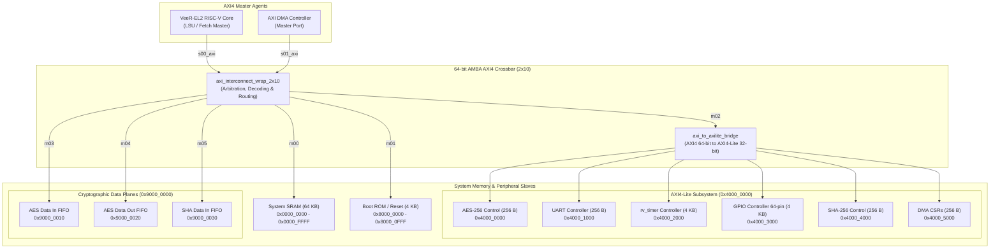

# RISC-V Cryptographic Telemetry Gateway SoC — System Address Map Specification

**Document Version:** 1.0  
**Target Architecture:** Western Digital VeeR-EL2 Core (RV32IMC)  
**System Bus:** 64-bit AMBA AXI4 Interconnect (2x10 Crossbar) with AXI4-Lite Protocol Bridge  
**Date:** October 2026  
**Target File Location:** `project_dir/doc/soc_address_map.md`  
**Associated Workbook:** `/home/student/1602-23-735-154/addressmap_mourya.xlsx`

---

## 1. System Architecture & Bus Topology

The RISC-V Cryptographic Telemetry Gateway SoC integrates high-performance cryptographic engines, DMA data-moving capability, rich communication peripherals, and a 32-bit RISC-V processor core onto a unified 64-bit AMBA AXI4 crossbar network.

### 1.1 Master Agents
1. **Master 0 (`s00_axi`): VeeR-EL2 CPU Core**  
   - Instruction Fetch Bus (AXI4 64-bit) & Load/Store Unit (LSU) Data Bus (AXI4 64-bit).
2. **Master 1 (`s01_axi`): AXI4 DMA Engine**  
   - Autonomous high-throughput direct memory access controller with dual 64-bit descriptors.

### 1.2 Interconnect Crossbar Topology

---

## 2. Global SoC Memory Map

The 32-bit physical address space (4 GB) is partitioned into functional regions optimized for low-latency CPU local execution, high-bandwidth streaming DMA transfers, and memory-mapped peripheral control.

| Region Base | Region End | Size | Interface | Port | Access | Description |
|:---|:---|:---|:---|:---|:---:|:---|
| `0x0000_0000` | `0x0000_FFFF` | 64 KB | AXI4 (64-bit) | m00 | R/W | **System SRAM**: Telemetry frame buffer, DMA staging area, packet queue |
| `0x4000_0000` | `0x4000_00FF` | 256 B | AXI4-Lite (32-bit) | m02 | R/W | **AES-256 Cryptographic Accelerator**: Control, Status, Keys, IV, Direct I/O |
| `0x4000_1000` | `0x4000_10FF` | 256 B | AXI4-Lite (32-bit) | m02 | R/W | **UART Serial Controller**: 16550-compatible, 16-byte FIFOs, Baud Generator |
| `0x4000_2000` | `0x4000_2FFF` | 4 KB | AXI4-Lite (32-bit) | m02 | R/W | **System Timer (`rv_timer`)**: 64-bit real-time counter, prescaler, comparator |
| `0x4000_3000` | `0x4000_3FFF` | 4 KB | AXI4-Lite (32-bit) | m02 | R/W | **GPIO Controller**: 64 General-Purpose I/O pins, atomic set/clear/toggle, IRQs |
| `0x4000_4000` | `0x4000_40FF` | 256 B | AXI4-Lite (32-bit) | m02 | R/W | **SHA-256 Hash Accelerator**: Control, Status, 512-bit Block Buffer, 256-bit Digest |
| `0x4000_5000` | `0x4000_50FF` | 256 B | AXI4-Lite (32-bit) | m02 | R/W | **DMA Controller**: Control, Status, Error stats, Dual 64-bit Descriptors |
| `0x4000_6000` | `0x4FFF_FFFF` | ~256 MB | AXI4-Lite (32-bit) | m02 | — | *Reserved Peripheral Expansion Space* |
| `0x8000_0000` | `0x8000_0FFF` | 4 KB | AXI4 (64-bit) | m01 | R/X | **Boot ROM / Reset Vector**: Power-on reset entry point, primary bootloader |
| `0x9000_0010` | `0x9000_001F` | 16 B | AXI4 (64-bit) | m03 | W | **AES-256 Data Input Endpoint**: High-speed burst streaming write target |
| `0x9000_0020` | `0x9000_002F` | 16 B | AXI4 (64-bit) | m04 | R | **AES-256 Data Output Endpoint**: High-speed burst streaming read target |
| `0x9000_0030` | `0x9000_003F` | 16 B | AXI4 (64-bit) | m05 | W | **SHA-256 Data Input Endpoint**: High-speed burst streaming write target |
| `0xEE00_0000` | `0xEE01_FFFF` | 128 KB | Internal SRAM | Core | R/W/X | **VeeR-EL2 ICCM**: Instruction Closely Coupled Memory (zero wait-state) |
| `0xF004_0000` | `0xF005_FFFF` | 128 KB | Internal SRAM | Core | R/W | **VeeR-EL2 DCCM**: Data Closely Coupled Memory (zero wait-state) |
| `0xF00C_0000` | `0xF00C_FFFF` | 64 KB | Internal Bus | Core | R/W | **VeeR-EL2 PIC**: Programmable Interrupt Controller (Gateway, Priority, Enables) |

---

## 3. VeeR-EL2 RISC-V Processor Subsystem Map

The Western Digital VeeR-EL2 core features tightly integrated local memories and interrupt control structures mapped directly onto the core's private address bus.

### 3.1 Core Local Memories
- **Reset Vector (`RV_RESET_VEC`)**: `0x8000_0000`  
- **ICCM Base (`RV_ICCM_BITS=17`)**: `0xEE00_0000` (Size: 128 KB, Range: `0xEE00_0000 - 0xEE01_FFFF`)  
  - Dedicated zero-latency single-cycle instruction execution memory.
- **DCCM Base (`RV_DCCM_BITS=17`)**: `0xF004_0000` (Size: 128 KB, Range: `0xF004_0000 - 0xF005_FFFF`)  
  - Dedicated single-cycle data scratchpad memory for stacks, critical structures, and ISR routines.
- **Debug Module Base**: `0x0000_0000` (Debug mode parking loop and JTAG TAP control).

### 3.2 PIC (Programmable Interrupt Controller) Register Map
Base Address: `0xF00C_0000`  
Size: 64 KB (`0xF00C_0000 - 0xF00C_FFFF`)

| Offset Range | Register Name | Width | Type | Reset Value | Description |
|:---|:---|:---:|:---:|:---:|:---|
| `0x0000 - 0x03FC` | `MEIPL[1..255]` | 4-bit | RW | `0x0` | Machine External Interrupt Priority Level for IRQs 1..255 (Priority 0–15) |
| `0x1000 - 0x101C` | `MEIP[0..7]` | 32-bit | RO | `0x0` | Machine External Interrupt Pending array (bit `i` indicates pending state of IRQ `i`) |
| `0x2000 - 0x201C` | `MEIE[0..7]` | 32-bit | RW | `0x0` | Machine External Interrupt Enable array (bit `i` enables IRQ `i`) |
| `0x3000` | `MPICCFG` | 1-bit | RW | `0x0` | PIC Configuration: bit [0] specifies priority order (0: 0 is lowest, 1: 15 is lowest) |
| `0x3004` | `MEIPT` | 4-bit | RW | `0x0` | Machine External Interrupt Priority Threshold (IRQs at or below threshold are masked) |
| `0x4000 - 0x43FC` | `MEIGWCTRL[1..255]` | 2-bit | RW | `0x0` | Gateway Control for IRQs 1..255: Bit [0]: Polarity (0=Active High, 1=Active Low) Bit [1]: Type (0=Level-sensitive, 1=Edge-sensitive) |
| `0x5000 - 0x53FC` | `MEIGWCLR[1..255]` | 1-bit | WO | `0x0` | Gateway Interrupt Clear for IRQs 1..255 (Write 1 to clear pending edge interrupt) |

---

## 4. DMA Controller Subsystem Map

The DMA Controller (`dma_axi_wrapper`) provides high-speed automated block memory transfers between memory and peripheral endpoints. It exposes an AXI4-Lite control interface aligned to 64-bit word boundaries.

**Base Address:** `0x4000_5000`  
**Address Window:** 256 Bytes (`0x4000_5000 - 0x4000_50FF`)  
**Bus Interface:** 32-bit AXI4-Lite Slave  

| Offset | Register Name | Width | Type | Reset Value | Bit-Field Breakdown & Functional Description |
|:---:|:---|:---:|:---:|:---:|:---|
| `0x00` | `DMA_CONTROL` | 32-bit | RW | `0x0000_03FC` | **DMA Transfer Control** • Bit [0] `go` (RW): Start DMA descriptor execution • Bit [1] `abort` (RW): Abort current active transfer • Bits [9:2] `max_burst` (RW): Maximum AXI burst length (0x00=1 beat, 0xFF=256 beats) |
| `0x08` | `DMA_STATUS` | 32-bit | RO | `0x0000_CAFE` | **DMA Operational Status** • Bits [15:0] `version` (RO): Hardware version tag (`0xCAFE`) • Bit [16] `done` (RO): Asserted when all enabled descriptors have finished • Bit [17] `error` (RO): Summary error flag |
| `0x10` | `DMA_ERROR_ADDR` | 32-bit | RO | `0x0000_0000` | **DMA Fault Address Register** • Bits [31:0] `error_addr`: Captures bus address that generated an AXI SLVERR/DECERR |
| `0x18` | `DMA_ERROR_STATS`| 32-bit | RO | `0x0000_0000` | **DMA Fault Diagnostics** • Bit [0] `error_type` (RO): 0 = Operational/AXI response fault, 1 = Config fault • Bit [1] `error_src` (RO): 0 = Read channel fault, 1 = Write channel fault • Bit [2] `error_trig` (RO): Error strobe latched status |
| `0x20` | `DMA_DESC0_SRC` | 32-bit | RW | `0x0000_0000` | **Descriptor 0 Source Address** • Bits [31:0]: 32-bit byte-aligned source address |
| `0x28` | `DMA_DESC1_SRC` | 32-bit | RW | `0x0000_0000` | **Descriptor 1 Source Address** • Bits [31:0]: 32-bit byte-aligned source address |
| `0x30` | `DMA_DESC0_DST` | 32-bit | RW | `0x0000_0000` | **Descriptor 0 Destination Address** • Bits [31:0]: 32-bit byte-aligned destination address |
| `0x38` | `DMA_DESC1_DST` | 32-bit | RW | `0x0000_0000` | **Descriptor 1 Destination Address** • Bits [31:0]: 32-bit byte-aligned destination address |
| `0x40` | `DMA_DESC0_BYTES`| 32-bit | RW | `0x0000_0000` | **Descriptor 0 Byte Count** • Bits [31:0]: Number of bytes to transfer |
| `0x48` | `DMA_DESC1_BYTES`| 32-bit | RW | `0x0000_0000` | **Descriptor 1 Byte Count** • Bits [31:0]: Number of bytes to transfer |
| `0x50` | `DMA_DESC0_CFG` | 32-bit | RW | `0x0000_0000` | **Descriptor 0 Channel Configuration** • Bit [0] `write_mode` (RW): 0 = INCR address, 1 = FIXED (FIFO mode) • Bit [1] `read_mode` (RW): 0 = INCR address, 1 = FIXED (FIFO mode) • Bit [2] `enable` (RW): 1 = Enable descriptor 0 for processing |
| `0x58` | `DMA_DESC1_CFG` | 32-bit | RW | `0x0000_0000` | **Descriptor 1 Channel Configuration** • Bit [0] `write_mode` (RW): 0 = INCR address, 1 = FIXED (FIFO mode) • Bit [1] `read_mode` (RW): 0 = INCR address, 1 = FIXED (FIFO mode) • Bit [2] `enable` (RW): 1 = Enable descriptor 1 for processing |

---

## 5. AES-256 Cryptographic Accelerator Subsystem Map

The AES-256 engine supports both 128-bit and 256-bit key standards across ECB, CBC, and CTR operational modes. It features direct register I/O for single-block operations and high-speed FIFO streaming ports for bulk telemetry frame processing.

**Control Base Address:** `0x4000_0000`  
**Address Window:** 256 Bytes (`0x4000_0000 - 0x4000_00FF`)  
**Streaming Data Input Port:** `0x9000_0010` (AXI4 Slave Port S3)  
**Streaming Data Output Port:** `0x9000_0020` (AXI4 Slave Port S4)  
**Bus Interface:** 32-bit AXI4-Lite Slave  

| Offset | Register Name | Width | Type | Reset Value | Bit-Field Breakdown & Functional Description |
|:---:|:---|:---:|:---:|:---:|:---|
| `0x00` | `AES_CTRL` | 32-bit | RW | `0x0000_0000` | **AES Operation Control** • Bit [0] `START` (WO): Pulse 1 to begin encryption/decryption cycle • Bit [1] `DEC_KEY_GEN` (WO): Pulse 1 to generate decryption round keys • Bit [2] `CBC_MODE` (RW): 0 = ECB Mode, 1 = CBC Mode • Bit [3] `RESET_CORE` (WO): Pulse 1 to reset internal state machines and FIFOs • Bit [4] `KEY_LEN` (RW): 0 = AES-128 (128-bit key), 1 = AES-256 (256-bit key) • Bit [5] `ENC_DEC` (RW): 0 = Encrypt mode, 1 = Decrypt mode • Bit [6] `CTR_MODE` (RW): 0 = Standard mode, 1 = Counter (CTR) mode |
| `0x04` | `AES_STATUS` | 32-bit | RO | `0x0000_00A0` | **AES Core Status** • Bit [0] `BUSY` (RO): Core actively processing cipher rounds • Bit [1] `DONE` (RO): Cipher execution completed for current block/stream • Bit [2] `KEY_READY` (RO): Key expansion completed, core ready • Bit [3] `DEC_KEY_DONE` (RO): Decryption key schedule expanded • Bit [4] `IN_FIFO_FULL` (RO): Streaming Input FIFO is full • Bit [5] `IN_FIFO_EMPTY` (RO): Streaming Input FIFO is empty • Bit [6] `OUT_FIFO_FULL` (RO): Streaming Output FIFO is full • Bit [7] `OUT_FIFO_EMPTY` (RO): Streaming Output FIFO is empty |
| `0x08` | `AES_KEY_0` | 32-bit | RW | `0x0000_0000` | Cipher Key Word 0 — bits [31:0] |
| `0x0C` | `AES_KEY_1` | 32-bit | RW | `0x0000_0000` | Cipher Key Word 1 — bits [63:32] |
| `0x10` | `AES_KEY_2` | 32-bit | RW | `0x0000_0000` | Cipher Key Word 2 — bits [95:64] |
| `0x14` | `AES_KEY_3` | 32-bit | RW | `0x0000_0000` | Cipher Key Word 3 — bits [127:96] |
| `0x18` | `AES_KEY_4` | 32-bit | RW | `0x0000_0000` | Cipher Key Word 4 — bits [159:128] *(AES-256 Mode)* |
| `0x1C` | `AES_KEY_5` | 32-bit | RW | `0x0000_0000` | Cipher Key Word 5 — bits [191:160] *(AES-256 Mode)* |
| `0x20` | `AES_KEY_6` | 32-bit | RW | `0x0000_0000` | Cipher Key Word 6 — bits [223:192] *(AES-256 Mode)* |
| `0x24` | `AES_KEY_7` | 32-bit | RW | `0x0000_0000` | Cipher Key Word 7 — bits [255:224] *(AES-256 Mode)* |
| `0x28` | `AES_IV_0` | 32-bit | RW | `0x0000_0000` | Initialization Vector Word 0 — bits [31:0] *(CBC/CTR)* |
| `0x2C` | `AES_IV_1` | 32-bit | RW | `0x0000_0000` | Initialization Vector Word 1 — bits [63:32] *(CBC/CTR)* |
| `0x30` | `AES_IV_2` | 32-bit | RW | `0x0000_0000` | Initialization Vector Word 2 — bits [95:64] *(CBC/CTR)* |
| `0x34` | `AES_IV_3` | 32-bit | RW | `0x0000_0000` | Initialization Vector Word 3 — bits [127:96] *(CBC/CTR)* |
| `0x38` | `AES_IN_DATA_0` | 32-bit | WO | `0x0000_0000` | Direct Input Data Word 0 — bits [31:0] (Manual block input) |
| `0x3C` | `AES_IN_DATA_1` | 32-bit | WO | `0x0000_0000` | Direct Input Data Word 1 — bits [63:32] |
| `0x40` | `AES_IN_DATA_2` | 32-bit | WO | `0x0000_0000` | Direct Input Data Word 2 — bits [95:64] |
| `0x44` | `AES_IN_DATA_3` | 32-bit | WO | `0x0000_0000` | Direct Input Data Word 3 — bits [127:96] |
| `0x48` | `AES_OUT_DATA_0`| 32-bit | RO | `0x0000_0000` | Direct Output Data Word 0 — bits [31:0] (Manual block output) |
| `0x4C` | `AES_OUT_DATA_1`| 32-bit | RO | `0x0000_0000` | Direct Output Data Word 1 — bits [63:32] |
| `0x50` | `AES_OUT_DATA_2`| 32-bit | RO | `0x0000_0000` | Direct Output Data Word 2 — bits [95:64] |
| `0x54` | `AES_OUT_DATA_3`| 32-bit | RO | `0x0000_0000` | Direct Output Data Word 3 — bits [127:96] |
| `0x58` | `AES_BLOCK_COUNT`| 32-bit | RW | `0x0000_0001` | Number of 128-bit blocks to process in streaming mode |
| `0x5C` | `AES_INTR_EN` | 32-bit | RW | `0x0000_0000` | **Interrupt Enable Register** • Bit [0] `DONE_INT_EN`: Interrupt CPU on block/transfer done • Bit [1] `ERR_INT_EN`: Interrupt CPU on FIFO error |

---

## 6. SHA-256 Hash Accelerator Subsystem Map

The SHA-256 engine computes standard cryptographic SHA-256 digests according to NIST FIPS 180-4. It contains a 16-word (512-bit) message block buffer and an 8-word (256-bit) digest result array.

**Control Base Address:** `0x4000_4000`  
**Address Window:** 256 Bytes (`0x4000_4000 - 0x4000_40FF`)  
**Streaming Data Input Port:** `0x9000_0030` (AXI4 Slave Port S5)  
**Bus Interface:** 32-bit AXI4-Lite Slave  

| Offset | Register Name | Width | Type | Reset Value | Bit-Field Breakdown & Functional Description |
|:---:|:---|:---:|:---:|:---:|:---|
| `0x00` | `SHA_NAME0` | 32-bit | RO | `0x7368_6132` | Core Identification String Word 0: ASCII `"sha2"` |
| `0x04` | `SHA_NAME1` | 32-bit | RO | `0x2D32_3536` | Core Identification String Word 1: ASCII `"-256"` |
| `0x08` | `SHA_VERSION` | 32-bit | RO | `0x302E_3830` | Core Version Number: ASCII `"0.80"` |
| `0x20` | `SHA_CTRL` | 32-bit | RW | `0x0000_0000` | **Hash Engine Control Register** • Bit [0] `INIT` (WO): Pulse 1 to initialize digest state with FIPS IV • Bit [1] `NEXT` (WO): Pulse 1 to process 512-bit message block • Bit [2] `MODE` (RW): 0 = SHA-224 mode, 1 = SHA-256 mode |
| `0x24` | `SHA_STATUS` | 32-bit | RO | `0x0000_0001` | **Hash Engine Status Register** • Bit [0] `READY` (RO): Core is idle and ready for new command • Bit [1] `DIGEST_VALID` (RO): Digest registers hold valid SHA result |
| `0x40` | `SHA_BLOCK_0` | 32-bit | RW | `0x0000_0000` | 512-bit Message Block Word 0 — bits [511:480] |
| `0x44` | `SHA_BLOCK_1` | 32-bit | RW | `0x0000_0000` | 512-bit Message Block Word 1 — bits [479:448] |
| `0x48` | `SHA_BLOCK_2` | 32-bit | RW | `0x0000_0000` | 512-bit Message Block Word 2 — bits [447:416] |
| `0x4C` | `SHA_BLOCK_3` | 32-bit | RW | `0x0000_0000` | 512-bit Message Block Word 3 — bits [415:384] |
| `0x50` | `SHA_BLOCK_4` | 32-bit | RW | `0x0000_0000` | 512-bit Message Block Word 4 — bits [383:352] |
| `0x54` | `SHA_BLOCK_5` | 32-bit | RW | `0x0000_0000` | 512-bit Message Block Word 5 — bits [351:320] |
| `0x58` | `SHA_BLOCK_6` | 32-bit | RW | `0x0000_0000` | 512-bit Message Block Word 6 — bits [319:288] |
| `0x5C` | `SHA_BLOCK_7` | 32-bit | RW | `0x0000_0000` | 512-bit Message Block Word 7 — bits [287:256] |
| `0x60` | `SHA_BLOCK_8` | 32-bit | RW | `0x0000_0000` | 512-bit Message Block Word 8 — bits [255:224] |
| `0x64` | `SHA_BLOCK_9` | 32-bit | RW | `0x0000_0000` | 512-bit Message Block Word 9 — bits [223:192] |
| `0x68` | `SHA_BLOCK_10`| 32-bit | RW | `0x0000_0000` | 512-bit Message Block Word 10 — bits [191:160] |
| `0x6C` | `SHA_BLOCK_11`| 32-bit | RW | `0x0000_0000` | 512-bit Message Block Word 11 — bits [159:128] |
| `0x70` | `SHA_BLOCK_12`| 32-bit | RW | `0x0000_0000` | 512-bit Message Block Word 12 — bits [127:96] |
| `0x74` | `SHA_BLOCK_13`| 32-bit | RW | `0x0000_0000` | 512-bit Message Block Word 13 — bits [95:64] |
| `0x78` | `SHA_BLOCK_14`| 32-bit | RW | `0x0000_0000` | 512-bit Message Block Word 14 — bits [63:32] |
| `0x7C` | `SHA_BLOCK_15`| 32-bit | RW | `0x0000_0000` | 512-bit Message Block Word 15 — bits [31:0] |
| `0x80` | `SHA_DIGEST_0`| 32-bit | RO | `0x6A09_E667` | 256-bit Digest State H0 — bits [255:224] |
| `0x84` | `SHA_DIGEST_1`| 32-bit | RO | `0xBB67_AE85` | 256-bit Digest State H1 — bits [223:192] |
| `0x88` | `SHA_DIGEST_2`| 32-bit | RO | `0x3C6E_F372` | 256-bit Digest State H2 — bits [191:160] |
| `0x8C` | `SHA_DIGEST_3`| 32-bit | RO | `0xA54F_F53A` | 256-bit Digest State H3 — bits [159:128] |
| `0x90` | `SHA_DIGEST_4`| 32-bit | RO | `0x510E_527F` | 256-bit Digest State H4 — bits [127:96] |
| `0x94` | `SHA_DIGEST_5`| 32-bit | RO | `0x9B05_688C` | 256-bit Digest State H5 — bits [95:64] |
| `0x98` | `SHA_DIGEST_6`| 32-bit | RO | `0x1F83_D9AB` | 256-bit Digest State H6 — bits [63:32] |
| `0x9C` | `SHA_DIGEST_7`| 32-bit | RO | `0x5BE0_CD19` | 256-bit Digest State H7 — bits [31:0] |

---

## 7. UART Serial Communication Controller Subsystem Map

The UART peripheral provides full-duplex asynchronous serial communication, equipped with 16-byte hardware TX and RX FIFOs, programmable baud rate divider, and configurable parity/stop-bit formats.

**Base Address:** `0x4000_1000`  
**Address Window:** 256 Bytes (`0x4000_1000 - 0x4000_10FF`) (Decoded within a 4 KB segment)  
**Bus Interface:** 32-bit AXI4-Lite Slave  

| Offset | Register Name | Width | Type | Reset Value | Bit-Field Breakdown & Functional Description |
|:---:|:---|:---:|:---:|:---:|:---|
| `0x00` | `UART_RBR_THR` | 32-bit | RW | `0x0000_0000` | **Receiver Buffer (Read) / Transmitter Holding (Write)** • Bits [7:0] `RBR` (RO): Read pops top received byte from RX FIFO • Bits [7:0] `THR` (WO): Write pushes byte to TX FIFO for transmission |
| `0x04` | `UART_IER` | 32-bit | RW | `0x0000_0000` | **Interrupt Enable Register** • Bit [0] `RX_DATA_EN`: Interrupt when RX FIFO contains data • Bit [1] `TX_EMPTY_EN`: Interrupt when TX FIFO becomes empty • Bit [2] `RX_ERR_EN`: Interrupt on line status error (parity/framing/break) |
| `0x08` | `UART_BAUD_DIV`| 32-bit | RW | `0x0000_001B` | **Baud Rate Clock Divisor Register** • Bits [15:0] `DIVISOR`: Baud clock divider value $$\text{Baud} = \frac{f_{\text{uart\_clk}}}{16 \times \text{DIVISOR}}$$ |
| `0x0C` | `UART_LCR` | 32-bit | RW | `0x0000_0003` | **Line Control Register** • Bits [1:0] `WLEN`: Word Length (00=5-bit, 01=6-bit, 10=7-bit, 11=8-bit) • Bit [2] `STOP`: Stop Bits (0=1 stop bit, 1=2 stop bits) • Bit [3] `PAR_EN`: Parity Enable (0=No parity, 1=Parity generation/check) • Bit [4] `PAR_EVEN`: Parity Select (0=Odd parity, 1=Even parity) |
| `0x14` | `UART_LSR` | 32-bit | RO | `0x0000_0060` | **Line Status Register** • Bit [0] `DATA_READY` (DR): 1 = Data available in RX FIFO • Bit [1] `OVERRUN_ERR` (OE): 1 = RX FIFO overrun error occurred • Bit [2] `PARITY_ERR` (PE): 1 = Received byte has parity error • Bit [3] `FRAMING_ERR` (FE): 1 = Invalid stop bit detected • Bit [4] `BREAK_INT` (BI): 1 = Break condition detected • Bit [5] `TX_HOLD_EMPTY` (THRE): 1 = TX FIFO is empty • Bit [6] `TX_EMPTY` (TEMT): 1 = TX FIFO and Shift Register are completely idle |

---

## 8. System Timer (`rv_timer`) Subsystem Map

The System Timer is an OpenTitan-compliant 64-bit real-time counter timer peripheral. It provides microsecond/nanosecond system tick generation, periodic interrupt capabilities, and hardware compare facilities.

**Base Address:** `0x4000_2000`  
**Address Window:** 4 KB (`0x4000_2000 - 0x4000_2FFF`)  
**Bus Interface:** 32-bit AXI4-Lite Slave  

| Offset | Register Name | Width | Type | Reset Value | Bit-Field Breakdown & Functional Description |
|:---:|:---|:---:|:---:|:---:|:---|
| `0x000` | `ALERT_TEST` | 32-bit | WO | `0x0000_0000` | **Alert Test Register** • Bit [0] `fatal_fault`: Write 1 to trigger fatal alert diagnostic |
| `0x004` | `CTRL` | 32-bit | RW | `0x0000_0000` | **Timer Global Control** • Bit [0] `active`: 1 = Enable 64-bit real-time counter increment |
| `0x100` | `INTR_ENABLE0` | 32-bit | RW | `0x0000_0000` | **Interrupt Enable Hart 0** • Bit [0] `timer_expired`: 1 = Enable interrupt when counter $\ge$ compare value |
| `0x104` | `INTR_STATE0` | 32-bit | RW1C | `0x0000_0000` | **Interrupt Status Hart 0** • Bit [0] `timer_expired`: Timer match interrupt pending. Write 1 to clear. |
| `0x108` | `INTR_TEST0` | 32-bit | WO | `0x0000_0000` | **Interrupt Software Test Hart 0** • Bit [0] `timer_expired`: Write 1 to simulate interrupt trigger |
| `0x10C` | `CFG0` | 32-bit | RW | `0x0000_0000` | **Timer Prescaler & Step Configuration** • Bits [11:0] `prescale`: Prescale divider (clock divided by `prescale + 1`) • Bits [23:16] `step`: Counter increment added on each tick |
| `0x110` | `TIMER_V_LOWER0`| 32-bit | RW | `0x0000_0000` | Current 64-bit Timer Counter Value — Lower 32 bits [31:0] |
| `0x114` | `TIMER_V_UPPER0`| 32-bit | RW | `0x0000_0000` | Current 64-bit Timer Counter Value — Upper 32 bits [63:32] |
| `0x118` | `COMPARE_LOWER0_0`| 32-bit| RW | `0xFFFF_FFFF` | 64-bit Comparator Match Threshold — Lower 32 bits [31:0] |
| `0x11C` | `COMPARE_UPPER0_0`| 32-bit| RW | `0xFFFF_FFFF` | 64-bit Comparator Match Threshold — Upper 32 bits [63:32] |

---

## 9. GPIO Controller Subsystem Map

The GPIO Controller manages 64 general-purpose I/O pins grouped into two 32-pin banks (Bank 0: Pins [31:0], Bank 1: Pins [63:32]). It supports atomic bit manipulation registers (Set, Clear, Toggle) and extensive interrupt triggering (rising edge, falling edge, active high level, active low level).

**Base Address:** `0x4000_3000`  
**Address Window:** 4 KB (`0x4000_3000 - 0x4000_3FFF`)  
**Bus Interface:** 32-bit AXI4-Lite Slave  

| Offset | Register Name | Width | Type | Reset Value | Bit-Field Breakdown & Functional Description |
|:---:|:---|:---:|:---:|:---:|:---|
| `0x000` | `GPIO_INFO` | 32-bit | RO | `0x0000_0040` | Implementation information (Reads 64, total implemented pins) |
| `0x004` | `GPIO_CFG` | 32-bit | RW | `0x0000_0000` | Global GPIO configuration parameters |
| `0x008` | `GPIO_MODE` | 32-bit | RW | `0x0000_0000` | Pin function multiplexer mode selection |
| `0x080` | `GPIO_EN_0` | 32-bit | RW | `0x0000_0000` | Output Enable for Pins [31:0] (1 = Driven as Output, 0 = High-Z / Input) |
| `0x084` | `GPIO_EN_1` | 32-bit | RW | `0x0000_0000` | Output Enable for Pins [63:32] |
| `0x100` | `GPIO_IN_0` | 32-bit | RO | `0x0000_0000` | Raw pin sample input level for Pins [31:0] |
| `0x104` | `GPIO_IN_1` | 32-bit | RO | `0x0000_0000` | Raw pin sample input level for Pins [63:32] |
| `0x180` | `GPIO_OUT_0` | 32-bit | RW | `0x0000_0000` | Output drive data register for Pins [31:0] |
| `0x184` | `GPIO_OUT_1` | 32-bit | RW | `0x0000_0000` | Output drive data register for Pins [63:32] |
| `0x200` | `GPIO_SET_0` | 32-bit | WO | `0x0000_0000` | Atomic Bit Set: Writing 1 drives corresponding pin [31:0] HIGH |
| `0x204` | `GPIO_SET_1` | 32-bit | WO | `0x0000_0000` | Atomic Bit Set: Writing 1 drives corresponding pin [63:32] HIGH |
| `0x280` | `GPIO_CLEAR_0`| 32-bit | WO | `0x0000_0000` | Atomic Bit Clear: Writing 1 drives corresponding pin [31:0] LOW |
| `0x284` | `GPIO_CLEAR_1`| 32-bit | WO | `0x0000_0000` | Atomic Bit Clear: Writing 1 drives corresponding pin [63:32] LOW |
| `0x300` | `GPIO_TOGGLE_0`| 32-bit| WO | `0x0000_0000` | Atomic Bit Toggle: Writing 1 inverts corresponding pin [31:0] |
| `0x304` | `GPIO_TOGGLE_1`| 32-bit| WO | `0x0000_0000` | Atomic Bit Toggle: Writing 1 inverts corresponding pin [63:32] |
| `0x380` | `INTRPT_RISE_EN_0` | 32-bit | RW | `0x0000_0000` | Rising-Edge Interrupt Enable for Pins [31:0] |
| `0x384` | `INTRPT_RISE_EN_1` | 32-bit | RW | `0x0000_0000` | Rising-Edge Interrupt Enable for Pins [63:32] |
| `0x400` | `INTRPT_FALL_EN_0` | 32-bit | RW | `0x0000_0000` | Falling-Edge Interrupt Enable for Pins [31:0] |
| `0x404` | `INTRPT_FALL_EN_1` | 32-bit | RW | `0x0000_0000` | Falling-Edge Interrupt Enable for Pins [63:32] |
| `0x480` | `INTRPT_LVL_HIGH_EN_0`| 32-bit| RW | `0x0000_0000` | Active-High Level Interrupt Enable for Pins [31:0] |
| `0x484` | `INTRPT_LVL_HIGH_EN_1`| 32-bit| RW | `0x0000_0000` | Active-High Level Interrupt Enable for Pins [63:32] |
| `0x500` | `INTRPT_LVL_LOW_EN_0` | 32-bit| RW | `0x0000_0000` | Active-Low Level Interrupt Enable for Pins [31:0] |
| `0x504` | `INTRPT_LVL_LOW_EN_1` | 32-bit| RW | `0x0000_0000` | Active-Low Level Interrupt Enable for Pins [63:32] |
| `0x580` | `INTRPT_STATUS_0` | 32-bit | RW1C | `0x0000_0000` | Cumulative Interrupt Status for Pins [31:0]. Write 1 to clear. |
| `0x584` | `INTRPT_STATUS_1` | 32-bit | RW1C | `0x0000_0000` | Cumulative Interrupt Status for Pins [63:32]. Write 1 to clear. |
| `0x600` | `INTRPT_RISE_STATUS_0` | 32-bit | RW1C | `0x0000_0000` | Rising-edge detected status for Pins [31:0] |
| `0x604` | `INTRPT_RISE_STATUS_1` | 32-bit | RW1C | `0x0000_0000` | Rising-edge detected status for Pins [63:32] |
| `0x680` | `INTRPT_FALL_STATUS_0` | 32-bit | RW1C | `0x0000_0000` | Falling-edge detected status for Pins [31:0] |
| `0x684` | `INTRPT_FALL_STATUS_1` | 32-bit | RW1C | `0x0000_0000` | Falling-edge detected status for Pins [63:32] |
| `0x700` | `INTRPT_LVL_LOW_STATUS_0`| 32-bit| RW1C| `0x0000_0000` | Low-level detected status for Pins [31:0] |
| `0x704` | `INTRPT_LVL_LOW_STATUS_1`| 32-bit| RW1C| `0x0000_0000` | Low-level detected status for Pins [63:32] |
| `0x780` | `INTRPT_LVL_HIGH_STATUS_0`| 32-bit| RW1C| `0x0000_0000` | High-level detected status for Pins [31:0] |
| `0x784` | `INTRPT_LVL_HIGH_STATUS_1`| 32-bit| RW1C| `0x0000_0000` | High-level detected status for Pins [63:32] |

---

## 10. System SRAM Memory Map

**Base Address:** `0x0000_0000`  
**Size:** 64 KB (`0x0000_0000 - 0x0000_FFFF`)  
**Bus Interface:** 64-bit AMBA AXI4 (Burst-capable, full strobe byte enables)  
**Access Permissions:** Read / Write, CPU & DMA accessible  

| Sub-Region Base | Sub-Region End | Size | Suggested Firmware Allocation |
|:---:|:---:|:---:|:---|
| `0x0000_0000` | `0x0000_3FFF` | 16 KB | Telemetry Input Frame Buffer (Raw telemetry reception queue from UART) |
| `0x0000_4000` | `0x0000_7FFF` | 16 KB | Cryptographic Working Staging Buffer (DMA staging for AES encryption/decryption) |
| `0x0000_8000` | `0x0000_BFFF` | 16 KB | SHA-256 Digest & Hash Calculation Message Scratchpad |
| `0x0000_C000` | `0x0000_FFFF` | 16 KB | Processed Telemetry Outbound Buffer & DMA Descriptors Storage |

---

## 11. SoC Interrupt Mapping Specification

All peripheral interrupt request (IRQ) output lines are routed directly to the Western Digital VeeR-EL2 Programmable Interrupt Controller (PIC) gateway inputs.

| IRQ # | Source Module | Signal Name | Trigger Type | Default Priority | PIC Enable Reg | PIC Gateway Reg | Functional Description |
|:---:|:---|:---|:---:|:---:|:---:|:---:|:---|
| **1** | UART Controller | `uart_irq` | Level / High | 5 | `MEIE[0]`, bit 1 | `MEIGWCTRL[1]` | RX FIFO data available / Line error interrupt |
| **2** | System Timer | `timer_intr[0]` | Level / High | 7 | `MEIE[0]`, bit 2 | `MEIGWCTRL[2]` | 64-bit real-time counter compare match event |
| **3** | AES-256 Accelerator | `aes_irq` | Edge / Rising | 6 | `MEIE[0]`, bit 3 | `MEIGWCTRL[3]` | AES cipher operation complete / FIFO done |
| **4** | SHA-256 Accelerator | `sha_irq` | Edge / Rising | 6 | `MEIE[0]`, bit 4 | `MEIGWCTRL[4]` | SHA hash digest computation valid / Ready |
| **5** | DMA Controller | `dma_done_o` | Edge / Rising | 8 | `MEIE[0]`, bit 5 | `MEIGWCTRL[5]` | DMA descriptor block transfer completed |
| **6** | DMA Controller | `dma_error_o`| Edge / Rising | 15 (Max) | `MEIE[0]`, bit 6 | `MEIGWCTRL[6]` | DMA AXI bus transfer fault (SLVERR/DECERR) |
| **7** | GPIO Bank 0 | `gpio_intr[0]` | Level / High | 4 | `MEIE[0]`, bit 7 | `MEIGWCTRL[7]` | GPIO Pins [31:0] edge/level triggered interrupt |
| **8** | GPIO Bank 1 | `gpio_intr[1]` | Level / High | 4 | `MEIE[0]`, bit 8 | `MEIGWCTRL[8]` | GPIO Pins [63:32] edge/level triggered interrupt |
| **9..255** | Reserved | `tied_zero` | — | 0 | `MEIE[x]` | `MEIGWCTRL[x]` | Unused interrupt gateway lines |
